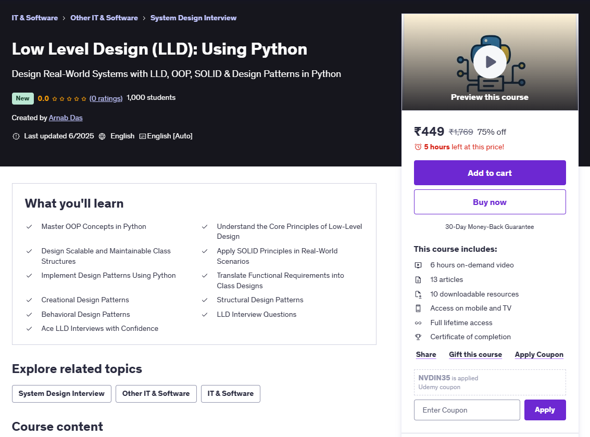

<h1 align="center">
  <a href="https://www.udemy.com/course/low-level-design-lld-using-python/?referralCode=4C2522034C6E65573E08"> 
    Low Level Design (LLD): Using Python 
  </a>
</h1>

  Design Real-World Systems with LLD, OOP, SOLID & Design Patterns in Python

  

 
